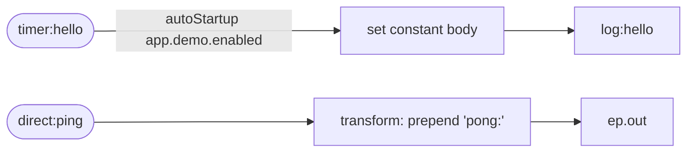

<!-- SPDX-License-Identifier: CC-BY-4.0 -->
# 02 · Wire Camel: the BOM and One-Starter-Per-Component

## Objective
Add Apache Camel to a plain Spring Boot app **and prove it boots** — the smallest possible first step
before any pattern. Along the way, learn the three things that make Camel-on-Spring-Boot painless:
the **starter** auto-wires everything, the **BOM** means you never write a version, and the
**one-starter-per-URI-scheme** rule tells you when you need to add another dependency.

## Scenario
There is no business scenario yet — this module *is* the wiring lesson:

- A **heartbeat** route (`HelloTimerRoute`) fires from `timer:hello` about once a second, sets a
  constant body, and writes it to `log:hello`. If you see the line, Camel started. Both `timer:` and
  `log:` are built into `camel-core`, so they need **no** extra starter.
- A **ping/pong** route (`PingRoute`) reads `direct:ping`, prepends `"pong:"` to the body, and sends
  it to `{{ep.out}}`. This gives the test something deterministic to assert on. `direct:` is also
  built-in.

The output target `{{ep.out}}` is a **property placeholder**: it resolves to `log:out` when you run
the app and to `mock:out` in tests. The heartbeat is gated by `app.demo.enabled` — `true` for `run`,
`false` for tests — so tests never see timer noise.

**Why "one starter per URI scheme"?** `camel-spring-boot-starter` gives you camel-core's built-in
schemes (`timer:`, `log:`, `direct:`, `mock:`, `seda:`). Any *other* scheme needs its own
`camel-<name>-starter`. Reference a scheme with no starter on the classpath and Camel fails fast at
startup with:

```
org.apache.camel.ResolveEndpointFailedException: Failed to resolve endpoint: jms://... due to:
No component found with scheme: jms
```

The fix is always "add the matching `camel-<scheme>-starter`" — never a version, because the BOM
supplies it.

## Message flow

`timer:hello --> log:hello   ||   direct:ping --transform 'pong:'--> ep.out`

## Components used
| Dependency | Why |
|---|---|
| `camel-spring-boot-starter` | the ONLY runtime dependency: auto-creates the `CamelContext`, auto-discovers `@Component` routes, and provides camel-core's built-in `timer:`, `log:`, `direct:`, `mock:` schemes and the Simple language. No version — the imported Camel Spring Boot **BOM** supplies it. |

No broker, no extra starter — everything here is built into `camel-core` and runs in-memory.

## How to run
```bash
# From the repo root. Red Hat build (default):
./mvnw -pl patterns/02-wire-camel spring-boot:run
# Behind a firewall / no Red Hat access — plain Apache Camel:
./mvnw -P upstream -pl patterns/02-wire-camel spring-boot:run
```
Once up, the heartbeat logs `Camel is wired and running ✅` every second. To exercise the ping route,
send a message to `direct:ping` from your own code / a later module — in this starter module the test
below is the driver.

## Test it
```bash
./mvnw -pl patterns/02-wire-camel test
```
Three tests prove the wiring: (1) the `CamelContext` was auto-created and **both** routes were
auto-discovered by ID; (2) `direct:ping` produces a reply on `mock:out` that **starts with** `pong:`;
(3) the reply prepends the original body exactly (`pong:hello`). Read the test as the spec.
