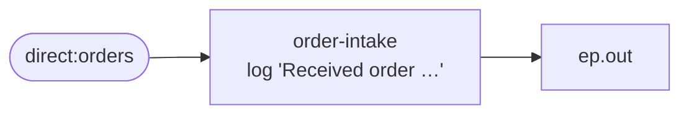

<!-- SPDX-License-Identifier: CC-BY-4.0 -->
# 03 · Your First Route: `from()`, `to()`, `routeId()`

## Objective
Learn the **anatomy of a Camel route**. Read any route **left-to-right, top-to-bottom**: it begins at one
`from(...)` **consumer**, flows through zero or more steps, and ends at a `to(...)` **producer**.

```
from( consumer ) ... steps ... to( producer )
```

That single shape underlies every other pattern in this course. We also cover the one habit that pays off
forever: **always give a route a `routeId(...)`**.

## Scenario
ShopFlow receives orders on the `direct:orders` channel. Our first route, `order-intake`, does the
smallest useful thing: it **logs** the order and **hands it to the next stop** (`ep.out`).

```java
from("direct:orders")     // CONSUMER — where messages enter
    .routeId("order-intake")
    .log("Received order ${body.orderId} from ${body.customer}")  // a step
    .to("{{ep.out}}");    // PRODUCER — where the message goes next
```

The producer target is a **property placeholder** (`{{ep.out}}`). In production it would be a
`direct:`/`jms:` endpoint; in tests it resolves to a `mock:` endpoint so we can prove what the route emits.

**Why `routeId("order-intake")`?** Without it, Camel auto-generates an id from start-up order —
`route1`, `route2`, `route3`, … Those numbers shift the moment you add, remove, or reorder a route, which
quietly breaks the three things that read route ids:

| Reads the id | Named route | Auto id |
|---|---|---|
| Tracing & logs | `order-intake failed` — a lead | `route1 failed` — meaningless |
| Metrics (Micrometer) | stable timer/counter tag | tag drifts when routes move |
| Management & tests | you stop / resume / `adviceWith` by id | id changes under you |

Rule of thumb: **every `from(...)` gets a `.routeId(...)` on the very next line.**

## Message flow

`direct:orders --[order-intake: log]--> ep.out`

## Components used
| Dependency | Why |
|---|---|
| `camel-spring-boot-starter` | boots the CamelContext + auto-discovers routes; provides `direct:`, `log:`, `timer:`, `mock:` and the Simple language (all in `camel-core`) |

No broker needed — this pattern runs entirely in-memory.

## How to run
```bash
# From the repo root. Red Hat build (default):
./mvnw -pl patterns/03-your-first-route spring-boot:run
# Behind a firewall / no Red Hat access — plain Apache Camel:
./mvnw -P upstream -pl patterns/03-your-first-route spring-boot:run
```
A demo feeder injects a sample order every 3s, so you'll see lines like
`Received order A-1001 from Asha` followed by the order landing on the `log:out` endpoint.

## Test it
```bash
./mvnw -pl patterns/03-your-first-route test
```
Two tests prove the route's contract against `mock:out`: one order in yields **exactly one** message out,
and the body **passes through unchanged**. Read the test as the spec.
