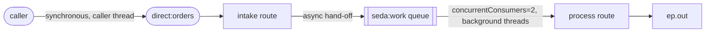

<!-- SPDX-License-Identifier: CC-BY-4.0 -->
# 04 · Message Channel & Endpoint: `direct:` vs `seda:`

## Objective
Connect two routes over an **in-memory Message Channel** and feel the difference between a
**synchronous** channel and an **asynchronous** one.

- A **Message Channel** is a named endpoint URI that carries messages between routes — here `seda:work`.
- A **Message Endpoint** is where a route attaches to a channel: `from(...)` is a *consumer* endpoint,
  `to(...)` is a *producer* endpoint.
- **`direct:`** is *synchronous* — the message is handled on the **caller's own thread**, and any
  exception propagates straight back to the caller.
- **`seda:`** is *asynchronous* — `to("seda:work")` drops the message on an **in-memory queue** and
  **returns immediately**; a background consumer thread picks it up later. ⚠️ That queue is
  **memory-only — not durable**: if the JVM stops, anything still queued is lost.

## Scenario
Orders arrive on the synchronous channel `direct:orders`. The **intake** route does a quick hand-off to
the asynchronous channel `seda:work` and returns. The **process** route drains `seda:work` with two
background consumers and forwards to `ep.out`. Because the two routes are joined by `seda:`, processing
runs on a *different* thread from whoever submitted the order — the app logs both thread names so you can
watch it happen.

The terminal target `{{ep.out}}` is a **property placeholder**. In production it would be a
`direct:`/`jms:` endpoint to a downstream service; in tests it resolves to a `mock:` endpoint so we can
prove delivery.

## Message flow

`direct:orders --(sync, caller thread)--> intake --> seda:work (async in-memory queue) --(2 threads)--> process --> ep.out`

## Components used
| Dependency | Why |
|---|---|
| `camel-spring-boot-starter` | boots the CamelContext + auto-discovers routes; provides `direct:`, `seda:`, `log:`, `mock:`, `timer:` and the Simple language (all in `camel-core`) |

No broker needed — both channels are in-memory.

## How to run
```bash
# From the repo root. Red Hat build (default):
./mvnw -pl patterns/04-message-channel-and-endpoint spring-boot:run
# Behind a firewall / no Red Hat access — plain Apache Camel:
./mvnw -P upstream -pl patterns/04-message-channel-and-endpoint spring-boot:run
```
A demo feeder injects a sample order every 3s, so you'll see paired lines like
`intake received 'order-1001' on thread ...main...` immediately followed by
`process handling 'order-1001' on thread ...seda://work...` — **different threads**, proving the async hop.

## Test it
```bash
./mvnw -pl patterns/04-message-channel-and-endpoint test
```
Two tests prove (1) the message crosses `seda:work` and lands on `mock:out` (the `MockEndpoint` waits out
the async hop), and (2) the `process` route ran on a **different thread** than the caller — the essence of
`seda:` vs `direct:`. Read the test as the spec.
