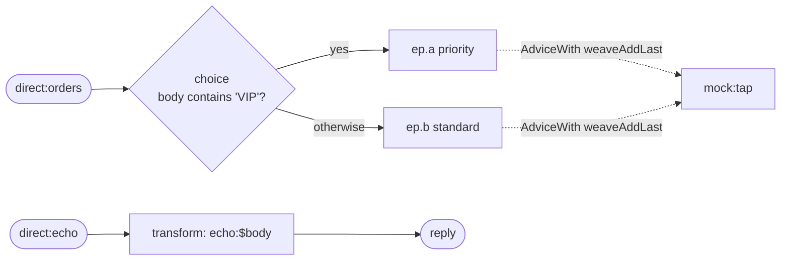

<!-- SPDX-License-Identifier: CC-BY-4.0 -->
# 06 · Testing Camel Routes

## Objective
Learn the **Camel test toolkit** itself. This module is not a new EIP — the two routes are deliberately
trivial. The point is the **test class**: how to prove a route does what you claim, entirely in memory,
with no broker. You'll use four tools: `MockEndpoint`, `ProducerTemplate`, `NotifyBuilder`, and
`AdviceWith` — and see why **the test is the spec**.

## Scenario
ShopFlow needs its routes covered by fast, deterministic tests. We put two tiny routes under test:

| Route id | Kind | What it does |
|---|---|---|
| `sample` | InOnly | `body contains 'VIP'` → `ep.a` (priority), else → `ep.b` (standard) |
| `echo` | InOut | transforms the body to `echo:<body>` and returns it (request/reply) |

The branch targets are **property placeholders** (`{{ep.a}}`, `{{ep.b}}`). In production they'd be
`direct:`/`jms:` endpoints; in tests they resolve to `mock:priority` / `mock:standard` so we can assert
exactly which branch a message took.

## Message flow

`direct:orders --choice--> [VIP] ep.a | [*] ep.b   (+AdviceWith tap-> mock:tap)   ;   direct:echo --transform--> reply`

## Components used
| Dependency | Why |
|---|---|
| `camel-spring-boot-starter` | boots the CamelContext + auto-discovers routes; provides `direct:`, `log:`, `mock:`, `timer:`, the Simple language, and the `NotifyBuilder` / `AdviceWith` helpers (all in `camel-core`) |
| `spring-boot-starter-test` *(test)* | JUnit 5 + AssertJ + the Spring test context |
| `camel-test-spring-junit5` *(test)* | `@CamelSpringBootTest` and `@UseAdviceWith` — wires Camel into the Spring Boot test |

No broker needed — everything runs in-memory.

### The toolkit, one method at a time
- **`@CamelSpringBootTest`** — boots the real Spring Boot + Camel context for the test and, by default,
  starts every route. Combine with `@SpringBootTest`, then `@Autowired CamelContext` / `ProducerTemplate`.
- **`MockEndpoint`** — a recording endpoint. Declare expectations up front
  (`expectedBodiesReceived`, `expectedMessageCount`) and verify with `MockEndpoint.assertIsSatisfied(context)`.
  Reset shared state in `@BeforeEach` via `MockEndpoint.resetMocks(context)`.
- **`ProducerTemplate`** — sends messages into a route. `sendBody` is fire-and-forget (InOnly);
  `requestBody(uri, body, Class)` is request/reply (InOut) and returns the reply so you can assert on it.
- **`NotifyBuilder`** — builds a condition over route activity (e.g. "one exchange from `direct:orders`
  is done") and blocks up to a timeout until it's true. Essential for **asynchronous** routes.
- **`AdviceWith`** — rewrites a route **at test time** without editing production code. With `@UseAdviceWith`
  the context does **not** auto-start; you weave your change (here `weaveAddLast().to("mock:tap")`), then call
  `context.start()`. Because it needs a stopped context, it lives in its **own** test class.

## How to run
```bash
# From the repo root. Red Hat build (default):
./mvnw -pl patterns/06-testing-camel-routes spring-boot:run
# Behind a firewall / no Red Hat access — plain Apache Camel:
./mvnw -P upstream -pl patterns/06-testing-camel-routes spring-boot:run
```
A demo feeder injects a rotating body every 3s (`VIP order #N` / `standard order #N`), so you'll see the
`sample` route log the message and land it on the matching `log:` endpoint.

## Test it
```bash
./mvnw -pl patterns/06-testing-camel-routes test
```
Two classes, five methods, each demonstrating one technique:

- `SampleRouteTest` (auto-started context)
  1. `MockEndpoint.expectedBodiesReceived` — a VIP body reaches `mock:priority` and nowhere else.
  2. the `otherwise` branch — a plain body reaches `mock:standard`.
  3. `ProducerTemplate.requestBody` — the `echo` route replies `echo:hello`.
  4. `NotifyBuilder` — wait until one exchange from `direct:orders` completes.
- `AdviceWithSampleRouteTest` (`@UseAdviceWith`, manual start)
  5. `AdviceWith.weaveAddLast().to("mock:tap")` taps the route's output, then `context.start()` and assert.

Read the tests as the spec.
