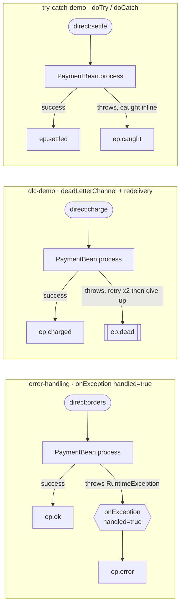

<!-- SPDX-License-Identifier: CC-BY-4.0 -->
# 07 · When a Route Throws: Error Handling Basics

## Objective
Understand **what happens when a step in a route fails** — and the three everyday ways to control it:
the **default error handler**, **`onException` + `handled(true)`**, and **`doTry`/`doCatch`** — plus a first
look at **redelivery** and a **dead-letter destination**. Everything runs in-memory; no broker.

> By default Camel wraps every route in a **default error handler**: if a step throws and nothing catches
> it, the exception is logged and propagated back to the caller, the exchange is marked failed, and the
> rest of the route is skipped. Nothing is retried, nothing is diverted. The strategies below replace that
> "just blow up" behaviour with something deliberate.

## Scenario
ShopFlow charges a card in `PaymentBean`. Orders flagged `failPayment=true` make the bean throw a
`RuntimeException` (a declined card, a downstream 500, a bug). We handle that failure three different ways,
one route each:

| Route | Consumer | Strategy | Failure lands on | Success lands on |
|---|---|---|---|---|
| `error-handling` | `direct:orders` | `onException(RuntimeException).handled(true)` — catch, log, divert | `ep.error` | `ep.ok` |
| `dlc-demo` | `direct:charge` | `errorHandler(deadLetterChannel(...))` — retry ×2, then park | `ep.dead` | `ep.charged` |
| `try-catch-demo` | `direct:settle` | `doTry()/doCatch()` — handle inline, like Java `try/catch` | `ep.caught` | `ep.settled` |

**Logging vs. a Dead Letter Channel:** logging tells you something broke and then the message is gone; a
Dead Letter Channel first *retries* (in case the fault was transient) and, if it still fails, *parks* the
message on a dedicated destination so ops can inspect and replay it. `handled(true)` also means the original
caller sees **success**, not a stack trace. (The full Dead Letter Channel pattern gets its own module later.)

All targets are **property placeholders** (`{{ep.ok}}` …): `log:` when you run the app, `mock:` in tests.

## Message flow

`orders --bean--> ok | (throws) onException handled --> error  ‖  charge --> DLC retry x2 --> dead  ‖  settle --> doTry/doCatch --> settled | caught`

## Components used
| Dependency | Why |
|---|---|
| `camel-spring-boot-starter` | boots the CamelContext + auto-discovers routes; provides `direct:`, `log:`, `timer:`, `mock:`, the `bean` component, the Simple language **and** the whole error-handling model — `onException`, `errorHandler`, `deadLetterChannel`, `doTry`/`doCatch` (all in `camel-core`) |

No broker needed — this pattern runs entirely in-memory.

## How to run
```bash
# From the repo root. Red Hat build (default):
./mvnw -pl patterns/07-error-handling-basics spring-boot:run
# Behind a firewall / no Red Hat access — plain Apache Camel:
./mvnw -P upstream -pl patterns/07-error-handling-basics spring-boot:run
```
A demo feeder injects an order every 3s, alternating good and failing. You'll see `Charging order A-1001`
followed either by `Payment OK …` landing on `log:ok`, or by `Payment FAILED … -> error channel` landing on
`log:error` — proof that a thrown step no longer aborts the app.

## Test it
```bash
./mvnw -pl patterns/07-error-handling-basics test
```
Five tests prove each branch: a good order to `mock:ok` (and **not** `mock:error`); a failing order diverted
to `mock:error` with **no** exception thrown back; a persistently failing charge parked on `mock:dead` after
retries (and **not** `mock:charged`); a failing settle caught locally to `mock:caught`; and a good settle to
`mock:settled`. Read the test as the spec.
