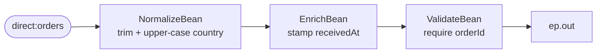

<!-- SPDX-License-Identifier: CC-BY-4.0 -->
# 08 · Pipes and Filters

## Objective
Compose behaviour from a chain of small, **single-responsibility steps** ("filters") connected by channels
("pipes"). Each filter does exactly one thing, so it is easy to reason about, **reuse**, reorder, and
**unit-test in isolation**. Reach for this pattern whenever a task is really several small transformations
in a row.

## Scenario
An incoming ShopFlow order needs three independent bits of processing before it moves on. Rather than one
big method, each is its own `@Component` filter chained into Camel's default pipeline:

| Step | Filter | Responsibility |
|---|---|---|
| 1 | `NormalizeBean` | trim + upper-case `country` (` in ` → `IN`) |
| 2 | `EnrichBean` | stamp a `receivedAt` timestamp onto the order |
| 3 | `ValidateBean` | reject the order (throw) if `orderId` is missing |

A chain of `.bean(...)` / `.to(...)` calls **is** the Camel pipeline: each step's output becomes the next
step's input. The output channel is a **property placeholder** (`{{ep.out}}`): in production it would be a
`direct:`/`jms:` endpoint to the next stage; in tests it resolves to a `mock:` endpoint so we can prove the
final body.

## Message flow

`direct:orders --> NormalizeBean --> EnrichBean --> ValidateBean --> ep.out`

## Components used
| Dependency | Why |
|---|---|
| `camel-spring-boot-starter` | boots the CamelContext + auto-discovers routes and `@Component` beans; provides `direct:`, `log:`, `mock:`, `timer:`, bean binding (`.bean(...)`) and the Simple language (all in `camel-core`) |

No broker needed — this pattern runs entirely in-memory.

## How to run
```bash
# From the repo root. Red Hat build (default):
./mvnw -pl patterns/08-pipes-and-filters spring-boot:run
# Behind a firewall / no Red Hat access — plain Apache Camel:
./mvnw -P upstream -pl patterns/08-pipes-and-filters spring-boot:run
```
A demo feeder injects a rotating **messy** sample order every 3s, so you'll see the raw body logged at
`Pipeline in:` (e.g. `country=' in '`) come out at `Pipeline out:` normalised to `country='IN'` with a
`receivedAt` timestamp before landing on the `log:out` endpoint.

## Test it
```bash
./mvnw -pl patterns/08-pipes-and-filters test
```
Two complementary tests read as the spec:

- **`PipesAndFiltersTest`** (route test) sends one raw order and asserts the body at `mock:out` is
  normalised (`country == "IN"`) and enriched (`receivedAt != null`), then sends an order with no
  `orderId` and asserts it is rejected before reaching the output — proving both pipeline outcomes.
- **`NormalizeBeanTest`** (plain unit test, no Spring) exercises `NormalizeBean` on its own in
  microseconds — the concrete payoff of keeping each filter a small, single-responsibility class.
