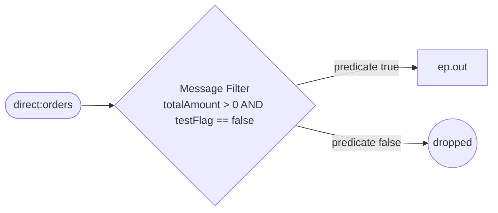

<!-- SPDX-License-Identifier: CC-BY-4.0 -->
# 09 · Message Filter: Drop Test and Zero-Value Orders

## Objective
**Discard uninteresting messages** so downstream never sees them. A Message Filter is a route that
forwards a message only when it satisfies a predicate, and **silently drops** everything else. Reach for
it whenever some inputs are simply noise — heartbeats, test traffic, empty/zero-value records — that no
downstream consumer should ever process.

## Scenario
ShopFlow's order stream is polluted by two kinds of junk that must never reach fulfilment:

| Order | Kept? | Why |
|---|---|---|
| real order, `totalAmount > 0`, `testFlag == false` | ✅ forwarded to `ep.out` | genuine revenue |
| `totalAmount == 0` | ❌ dropped | nothing to fulfil |
| `testFlag == true` | ❌ dropped | QA / smoke-test traffic |

The keep rule is a single Simple predicate — `totalAmount > 0 AND testFlag == false`. The one output
target is a **property placeholder** (`{{ep.out}}`). In production it'd be a `direct:`/`jms:` endpoint;
in tests it resolves to a `mock:` endpoint so we can prove exactly what survives.

### Message Filter vs a single-branch `choice()`
`filter(pred)` is exactly a `choice().when(pred)...` with **no `otherwise`** — a one-armed router. Use
`filter()` when the "else" is *do nothing, drop it*: it reads as intent ("keep only these") and needs no
dead-end branch. Use `choice()` the moment there is more than one keep-destination, or you want to *react*
to the rejects.

### Silent drop vs an Invalid Message Channel
Silent drop is right when a rejected message is genuinely **uninteresting** — test traffic, a zero-value
line — and losing it costs nothing and needs no audit. It is the **wrong** default when a message is
*unexpected* rather than *uninteresting*: a malformed or business-invalid order you may need to inspect,
alert on, or replay. Then don't drop into the void — route the rejects to an **Invalid Message Channel**
(e.g. `.filter(pred).to(ep.out).end()` plus an explicit `else`/second route sending failures to
`ep.invalid` or a dead-letter queue). Rule of thumb: **drop noise, capture anomalies.**

## Message flow

`direct:orders --filter[amount>0 && !test]--> ep.out   (else: dropped)`

## Components used
| Dependency | Why |
|---|---|
| `camel-spring-boot-starter` | boots the CamelContext + auto-discovers routes; provides `direct:`, `log:`, `mock:`, `timer:` and the Simple language (all in `camel-core`) |

No broker needed — this pattern runs entirely in-memory.

## How to run
```bash
# From the repo root. Red Hat build (default):
./mvnw -pl patterns/09-message-filter spring-boot:run
# Behind a firewall / no Red Hat access — plain Apache Camel:
./mvnw -P upstream -pl patterns/09-message-filter spring-boot:run
```
A demo feeder injects a rotating sample every 3s — one real order, one zero-value order, one test order —
so you'll see the real one land on the `log:kept` endpoint while the other two are considered and then
silently dropped.

## Test it
```bash
./mvnw -pl patterns/09-message-filter test
```
One test sends three orders — a valid one, a zero-value one, and a test-flagged one — and asserts that
**exactly one** reaches `mock:out` (the valid order) while the two rejects leave no trace. Read the test
as the spec.
