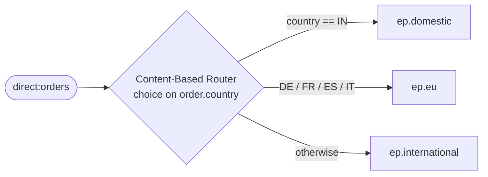

<!-- SPDX-License-Identifier: CC-BY-4.0 -->
# 03 · Content-Based Router

## Objective
Send each message to a **different destination based on its content** — here, route each order by its
destination country. Reach for this pattern whenever "where this goes next" depends on "what's inside."

## Scenario
ShopFlow fulfils orders differently by region:

| Country | Goes to |
|---|---|
| `IN` (domestic) | local warehouse (`ep.domestic`) |
| `DE`, `FR`, `ES`, `IT` (EU) | EU hub (`ep.eu`) |
| anything else | international handler (`ep.international`) |

The branch targets are **property placeholders** (`{{ep.domestic}}` …). In production they'd be
`direct:`/`jms:` endpoints; in tests they resolve to `mock:` endpoints so we can prove the routing.

## Message flow

`direct:orders --choice--> [IN] ep.domestic | [EU] ep.eu | [*] ep.international`

## Components used
| Dependency | Why |
|---|---|
| `camel-spring-boot-starter` | boots the CamelContext + auto-discovers routes; provides `direct:`, `log:`, `mock:`, `timer:` and the Simple language (all in `camel-core`) |

No broker needed — this pattern runs entirely in-memory.

## How to run
```bash
# From the repo root. Red Hat build (default):
./mvnw -pl patterns/10-content-based-router spring-boot:run
# Behind a firewall / no Red Hat access — plain Apache Camel:
./mvnw -P upstream -pl patterns/10-content-based-router spring-boot:run
```
A demo feeder injects a rotating sample order every 3s, so you'll see lines like
`Routing order A-1001 bound for IN` followed by the order landing on the matching `log:` endpoint.

## Test it
```bash
./mvnw -pl patterns/10-content-based-router test
```
Three tests prove one order to `mock:domestic` (IN), one to `mock:eu` (DE), and one to
`mock:international` (US) — and **zero** to the other two branches each time. Read the test as the spec.
