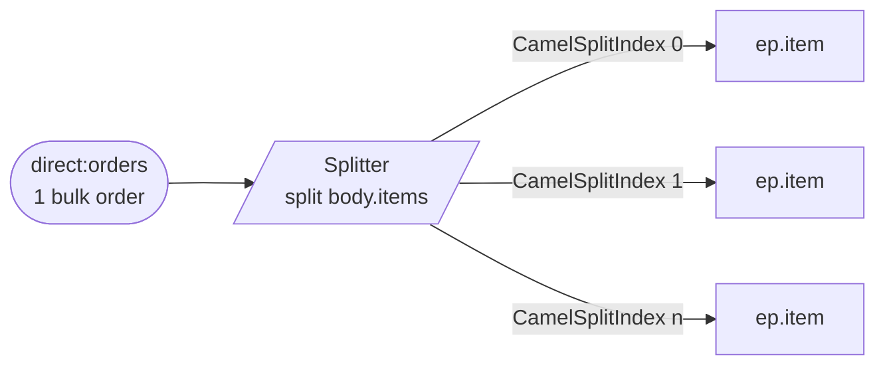

<!-- SPDX-License-Identifier: CC-BY-4.0 -->
# 11 · Splitter

## Objective
Transmit ONE composite message as a **sequence of smaller messages** so each element can be handled on
its own. Reach for the **Splitter** whenever a single payload actually carries "a list of things" — a
bulk order of line items, a batch file of records, a basket of products — and downstream steps need to
act on each thing individually.

## Scenario
ShopFlow receives a bulk `Order` that bundles several line items:

| In (1 message) | Out (N messages) |
|---|---|
| `Order{ orderId: A-1001, items: [SKU-1, SKU-2, SKU-3] }` | `SKU-1`, then `SKU-2`, then `SKU-3` |

`split(simple("${body.items}"))` fans the list out. Camel stamps each sub-message with two headers:

| Header | Meaning |
|---|---|
| `CamelSplitIndex` | 0-based position of this item in the sequence |
| `CamelSplitSize` | total number of items — set only when **not** streaming (see below) |

The per-item target is a **property placeholder** (`{{ep.item}}`). In production it'd be a
`direct:`/`jms:` endpoint to a per-item handler; in tests it resolves to a `mock:` endpoint so we can
count the fan-out.

> **`.streaming()` for large inputs.** For a huge list (or a giant file/stream you don't want to hold in
> memory) add `.streaming()` after `split(...)`: Camel then iterates lazily in constant memory instead
> of materialising every element up front. The trade-off is that `CamelSplitSize` is **unknown until the
> final element**, so don't depend on it downstream when streaming.

## Message flow

`direct:orders --split(body.items)--> ep.item (once per line item)`

## Components used
| Dependency | Why |
|---|---|
| `camel-spring-boot-starter` | boots the CamelContext + auto-discovers routes; provides `direct:`, `log:`, `mock:`, `timer:`, the Simple language and the `split()` EIP (all in `camel-core`) |

No broker needed — this pattern runs entirely in-memory.

## How to run
```bash
# From the repo root. Red Hat build (default):
./mvnw -pl patterns/11-splitter spring-boot:run
# Behind a firewall / no Red Hat access — plain Apache Camel:
./mvnw -P upstream -pl patterns/11-splitter spring-boot:run
```
A demo feeder injects a sample 3-line order every 3s, so you'll see a `Splitting order A-1001` line
followed by three `item 0 of 3 …`, `item 1 of 3 …`, `item 2 of 3 …` lines landing on the `log:` endpoint.

## Test it
```bash
./mvnw -pl patterns/11-splitter test
```
Two tests prove the fan-out: one bulk order of three items produces **exactly three** messages on
`mock:item` with the item bodies in order, and every sub-message carries the right `CamelSplitIndex`
(0, 1, 2) and `CamelSplitSize` (3). Read the test as the spec.
