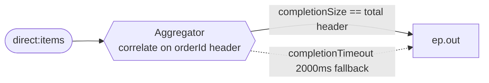

<!-- SPDX-License-Identifier: CC-BY-4.0 -->
# 12 · Aggregator: Re-Assemble Line-Item Results into One Confirmation

## Objective
**Combine related messages into one.** The Aggregator is the mirror image of the Splitter: where a
Splitter fans one message out into many, an Aggregator collects the many back into a single message.
Reach for it whenever independent results — line items, shard responses, batch rows — need to be
re-assembled and released together once the group is "complete."

## Scenario
ShopFlow processes an order's line items independently (priced/validated one at a time), then must send
**one** confirmation per order. Each item arrives on `direct:items` carrying two headers:

| Header | Role | Example |
|---|---|---|
| `orderId` | **correlation key** — which order this item belongs to | `A-1` |
| `total` | expected item count — drives **completion** | `3` |

The Aggregator groups items by `orderId`, folds each into an `OrderConfirmation` via the
`AggregationStrategy`, and emits the confirmation when a completion condition fires:

- **`completionSize(total)`** — release as soon as all expected items are in (the happy path), **or**
- **`completionTimeout(2000)`** — a safety net: if an item never arrives, release the partial after 2s.

The output target is a **property placeholder** (`{{ep.out}}`). In production it'd be a `direct:`/`jms:`
endpoint; in tests it resolves to a `mock:` endpoint so we can prove exactly what was emitted.

## Message flow

`direct:items --aggregate(correlate on orderId; complete on size==total OR timeout 2s)--> ep.out`

The classic shape this completes is **splitter → process → aggregator**: split an order into items,
process each, then aggregate the results back into one confirmation. The demo feeder wires exactly that
(`.split(body()).to("direct:items")`) so `spring-boot:run` shows the whole round-trip.

## Components used
| Dependency | Why |
|---|---|
| `camel-spring-boot-starter` | boots the CamelContext + auto-discovers routes; provides `direct:`, `log:`, `mock:`, `timer:`, the Simple language, and the **Aggregator EIP** (all in `camel-core`) |

No broker needed — this pattern runs entirely in-memory. The `AggregationStrategy`
(`LineItemAggregationStrategy`) is plain Java: on the first item per group it seeds a fresh
`OrderConfirmation`; on each later item it folds the item into the one already being built.

## How to run
```bash
# From the repo root. Red Hat build (default):
./mvnw -pl patterns/12-aggregator spring-boot:run
# Behind a firewall / no Red Hat access — plain Apache Camel:
./mvnw -P upstream -pl patterns/12-aggregator spring-boot:run
```
A demo feeder emits a fresh order every 6s, splits it into 3 line items, and feeds them to the
Aggregator — so you'll see three `Item …` lines followed by one `Confirmation for order A-… : 100 total`
landing on the `log:confirmation` endpoint.

## Test it
```bash
./mvnw -pl patterns/12-aggregator test
```
Three tests prove the pattern's outcomes (read them as the spec):
1. **3 items → 1 confirmation** — `completionSize` releases exactly one message containing all 3 items.
2. **Missing item → timeout** — only 2 of 3 promised items arrive; `completionTimeout` still releases the partial.
3. **Independent correlation** — interleaved items from two orders aggregate into two separate confirmations.
