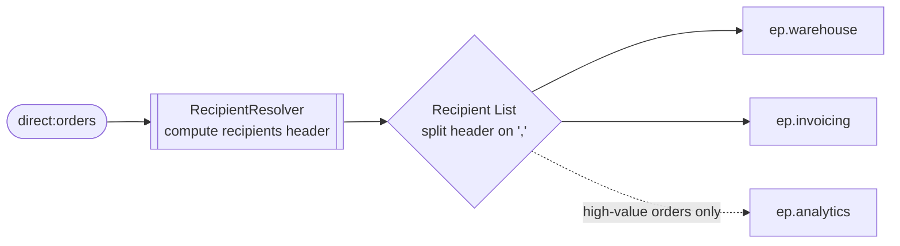

<!-- SPDX-License-Identifier: CC-BY-4.0 -->
# 13 · Recipient List: Fan Out to a Dynamic Set of Systems

## Objective
Route **one message to a set of recipients that is computed at runtime**. Reach for this pattern when
"who needs a copy of this message" is decided per message — not fixed in the route. It is the dynamic
sibling of a static `multicast()`: same fan-out, but the destination list is data-driven.

## Scenario
Every ShopFlow order must reach some systems always, and others only sometimes:

| Recipient | When |
|---|---|
| warehouse (`ep.warehouse`) | **always** — every order ships |
| invoicing (`ep.invoicing`) | **always** — every order bills |
| analytics (`ep.analytics`) | **only high-value orders** (`totalAmount` ≥ `app.order.high-value-threshold`, default `1000`) |

A `@Component` `RecipientResolver` builds the list per message and returns it as a **comma-separated string
of endpoint URIs**. Those base endpoints are **property placeholders** (`ep.warehouse` …): in production
they'd be `jms:`/`http:` endpoints; in tests they resolve to `mock:` endpoints so we can prove the fan-out.
The route stores the resolver's result in a `recipients` header and hands it to `recipientList(...)`.

## Message flow

`direct:orders --resolver--> recipientList(header "recipients") --> ep.warehouse + ep.invoicing (+ ep.analytics when high-value)`

## Components used
| Dependency | Why |
|---|---|
| `camel-spring-boot-starter` | boots the CamelContext + auto-discovers routes; provides `direct:`, `log:`, `mock:`, `timer:`, bean binding and the `recipientList()` EIP (all in `camel-core`) |

No broker needed — this pattern runs entirely in-memory.

## How to run
```bash
# From the repo root. Red Hat build (default):
./mvnw -pl patterns/13-recipient-list spring-boot:run
# Behind a firewall / no Red Hat access — plain Apache Camel:
./mvnw -P upstream -pl patterns/13-recipient-list spring-boot:run
```
A demo feeder injects a sample order every 3s with amounts that alternate between low and high, so you'll
see lines like `Fanning out order A-2001 (amount 250)` land on `log:warehouse` and `log:invoicing` only,
while high-value orders (e.g. `amount 5000`) *also* land on `log:analytics`.

## Test it
```bash
./mvnw -pl patterns/13-recipient-list test
```
Two tests prove the dynamic recipient list: a **low-value** order (`250`) reaches `mock:warehouse` and
`mock:invoicing` once each and `mock:analytics` **zero** times; a **high-value** order (`5000`) reaches
**all three** once each. Read the test as the spec.

### Recipient List vs. static `multicast()`
- `multicast().to("a").to("b")` — targets are **hardcoded in the route** at design time; every message
  goes to the same fixed set.
- `recipientList(header("recipients"), ",")` — targets come from **message/computed data**, so the set can
  differ per message (here: two recipients for low-value orders, three for high-value).
- **Parallel processing:** by default both fan out **sequentially** (one recipient after another). Add
  `.recipientList(...).parallelProcessing()` (or `.multicast().parallelProcessing()`) to dispatch to
  recipients concurrently — faster when downstreams are slow/independent, at the cost of ordering
  guarantees and a shared thread pool. Also consider `.stopOnException()` / an `AggregationStrategy` if you
  need to combine replies or fail fast. This module keeps the default (sequential, in-memory) for a
  deterministic, broker-free test.
