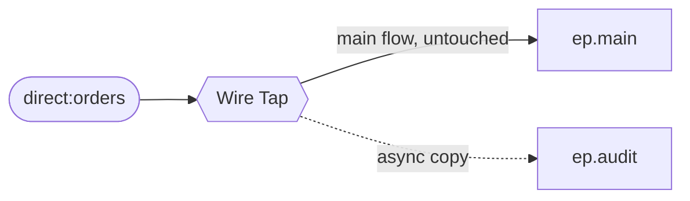

<!-- SPDX-License-Identifier: CC-BY-4.0 -->
# 14 · Wire Tap: Copy Every Order to an Audit Trail

## Objective
Send a **copy** of every message to a secondary channel **without disturbing the main flow** — here, drop
a copy of each order onto an audit trail while the order keeps travelling down the main pipeline. Reach for
this pattern whenever you need to observe, log, or audit traffic and the observer must **not** change or
slow down what the main route does.

Wire Tap is **asynchronous, fire-and-forget**: Camel does not wait for the audit channel before the main
flow continues, and the tap does **not** alter the main exchange. Contrast this with **Multicast** /
**Recipient List**, which fan a message out to several destinations *as part of* the main route (and, by
default, wait for them).

## Scenario
ShopFlow must keep an audit copy of every order for compliance, but auditing must never hold up
fulfilment:

| Endpoint | Role |
|---|---|
| `ep.main` | where the order continues in the main flow |
| `ep.audit` | secondary channel that receives a fire-and-forget **copy** of every order |

Both targets are **property placeholders** (`{{ep.main}}`, `{{ep.audit}}`). In production they'd be
`direct:`/`jms:` endpoints (a downstream service and an audit store); in tests they resolve to `mock:`
endpoints so we can prove the copy happened.

## Message flow

`direct:orders --wireTap(copy)--> ep.audit ; --continue--> ep.main`

## Components used
| Dependency | Why |
|---|---|
| `camel-spring-boot-starter` | boots the CamelContext + auto-discovers routes; provides `direct:`, `log:`, `mock:`, `timer:`, the `wireTap()` DSL and the Simple language (all in `camel-core`) |

No broker needed — this pattern runs entirely in-memory.

## How to run
```bash
# From the repo root. Red Hat build (default):
./mvnw -pl patterns/14-wire-tap spring-boot:run
# Behind a firewall / no Red Hat access — plain Apache Camel:
./mvnw -P upstream -pl patterns/14-wire-tap spring-boot:run
```
A demo feeder injects a sample order every 3s, so you'll see lines like
`Order A-1001 — tapping a copy to audit, main flow continues`, then the **same** order landing on both
`log:main` (main flow) and `log:audit` (the tapped copy).

## Test it
```bash
./mvnw -pl patterns/14-wire-tap test
```
Two tests prove the tap: one order arrives on **both** `mock:main` and `mock:audit` with the same body,
and a batch of three orders lands as three on each — showing **every** order is copied. Because the tap is
asynchronous, the tests rely on `MockEndpoint`'s built-in wait (a `MockEndpoint` with an expected count
waits up to its timeout before `assertIsSatisfied` returns). Read the test as the spec.
