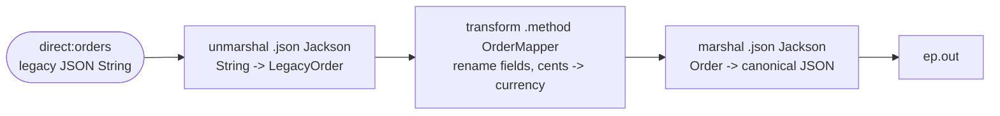

<!-- SPDX-License-Identifier: CC-BY-4.0 -->
# 15 · Message Translator & Data Formats: JSON <-> POJO with Jackson

## Objective
Convert a message from one **format** to another so two systems that speak different "languages" can talk.
A **Message Translator** sits between them and reshapes the payload. Along the way you'll meet a **Data
Format** — the reusable codec you plug into `marshal`/`unmarshal` to go bytes/String ⇄ POJO.

## Scenario
A partner posts orders in a terse **legacy JSON** shape — abbreviated keys and money as an integer number
of **cents**:

```json
{ "id": "A-1001", "cust": "Acme Corp", "amt": 123499, "cur": "USD" }
```

Our system speaks a clean **canonical** shape — readable names and money in whole currency units:

```json
{ "orderId": "A-1001", "customer": "Acme Corp", "amount": 1234.99, "currency": "USD" }
```

The route does it in three moves: **unmarshal** the JSON String into a `LegacyOrder` POJO (Jackson data
format), **transform** it to a canonical `Order` via `OrderMapper` (renames fields, `cents → currency`),
then **marshal** that back to JSON (Jackson data format). The output endpoint is a **property placeholder**
(`{{ep.out}}`): in production it's a `direct:`/`jms:` endpoint; in tests it resolves to `mock:out` so we
can prove the translation.

## Message flow

`direct:orders --unmarshal--> LegacyOrder --OrderMapper--> Order --marshal--> ep.out`

## Components used
| Dependency | Why |
|---|---|
| `camel-spring-boot-starter` | boots the CamelContext + auto-discovers routes; provides `direct:`, `log:`, `timer:`, `mock:` and the Simple language (all in `camel-core`) |
| `camel-jackson-starter` | the **Jackson JSON Data Format** — the reusable codec used by `.unmarshal().json(JsonLibrary.Jackson, LegacyOrder.class)` and `.marshal().json(JsonLibrary.Jackson)` |

No broker needed — this pattern runs entirely in-memory.

## How to run
```bash
# From the repo root. Red Hat build (default):
./mvnw -pl patterns/15-message-translator spring-boot:run
# Behind a firewall / no Red Hat access — plain Apache Camel:
./mvnw -P upstream -pl patterns/15-message-translator spring-boot:run
```
A demo feeder injects a rotating legacy JSON order every 3s, so you'll see a `Translating legacy order: …`
line followed by the matching `Emitting canonical order: {"orderId":…,"amount":1234.99,…}` landing on the
`log:out` endpoint.

## Test it
```bash
./mvnw -pl patterns/15-message-translator test
```
The tests push legacy JSON into `direct:orders`, then **parse** the JSON that lands on `mock:out` and assert
the renamed field (`cust` → `customer`) and the converted amount (`123499` cents → `1234.99`), and that the
legacy keys are gone. Read the test as the spec. Human-readable before/after samples live in
`src/test/resources/data/`.
