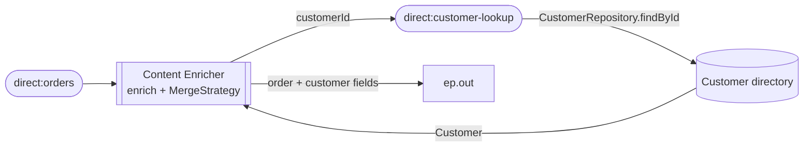

<!-- SPDX-License-Identifier: CC-BY-4.0 -->
# 16 · Content Enricher: Augment an Order with Customer Data

## Objective
Add data a message is **missing** by fetching it from another source and merging it in. Reach for the
**Content Enricher** whenever a message carries a *reference* (an id, a code) but the next step needs the
*full record* behind it. Camel gives you two verbs: `enrich()` (request/reply — call a resource on demand)
and `pollEnrich()` (consume from a resource — read a file, poll a queue). This module uses `enrich()`.

## Scenario
ShopFlow orders arrive knowing only **which** customer placed them (`customerId`) — not **who** they are.
Before an order moves downstream we enrich it with the customer's name, email and loyalty tier, looked up
from an in-memory customer directory (a stand-in for a DB or REST service — **no real HTTP**).

| Incoming order | After enrichment |
|---|---|
| `orderId=A-1001, customerId=C-1` | `+ Alice Kumar / alice@example.com / GOLD` |
| `orderId=A-1002, customerId=C-2` | `+ Bruno Lang / bruno@example.com / SILVER` |
| `orderId=A-1003, customerId=C-9` (unknown) | unchanged — the order is **not** dropped |

The output endpoint is a **property placeholder** (`{{ep.out}}`). In production it'd be a `direct:`/`jms:`
endpoint; in tests it resolves to a `mock:` endpoint so we can assert on the enriched order.

## Message flow

`direct:orders --enrich--> direct:customer-lookup (findById) --MergeStrategy--> ep.out`

Two halves make the pattern: the **resource route** (`direct:customer-lookup`, whose bean returns a
`Customer` by id) fetches the extra data, and the **`AggregationStrategy`** (`MergeStrategy`) copies that
customer onto the original order and returns the *order* so the enriched message keeps flowing.

## Components used
| Dependency | Why |
|---|---|
| `camel-spring-boot-starter` | boots the CamelContext + auto-discovers routes; provides `direct:`, `log:`, `timer:`, `mock:`, the bean component, the Simple language and the `enrich()` / `AggregationStrategy` DSL (all in `camel-core`) |

No broker and no network needed — this pattern runs entirely in-memory.

## How to run
```bash
# From the repo root. Red Hat build (default):
./mvnw -pl patterns/16-content-enricher spring-boot:run
# Behind a firewall / no Red Hat access — plain Apache Camel:
./mvnw -P upstream -pl patterns/16-content-enricher spring-boot:run
```
A demo feeder injects a rotating sample order every 3s, so you'll see `Enriching order A-1001 for customer C-1`
followed by the enriched order (now carrying `customerName=Alice Kumar … customerTier=GOLD`) landing on the
`log:out` endpoint. Watch `C-9` flow through with empty customer fields — a lookup miss that isn't dropped.

## Test it
```bash
./mvnw -pl patterns/16-content-enricher test
```
Three tests prove the enricher: one order enriched with `C-1`'s details on `mock:out`, a second with a
**different** id (`C-2`) to show the lookup keys off `customerId` rather than returning a constant, and an
**unknown** id (`C-9`) that still reaches `mock:out` with its customer fields left null. Read the test as the spec.
