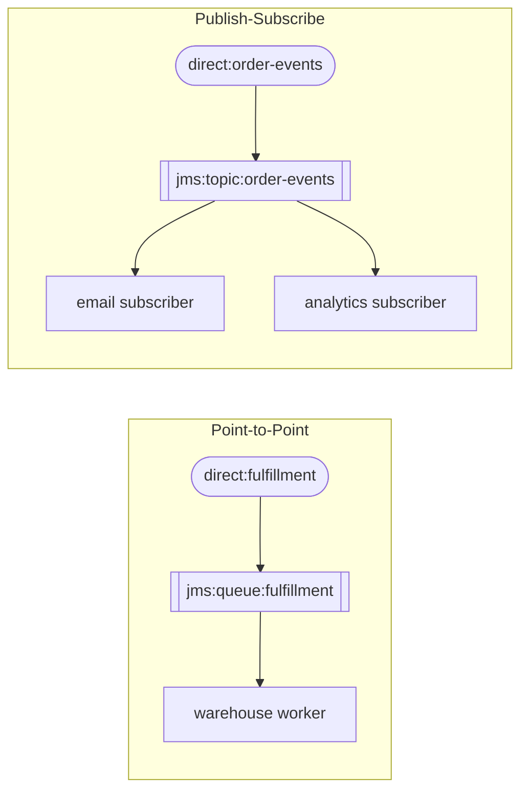

<!-- SPDX-License-Identifier: CC-BY-4.0 -->
# 18 · Point-to-Point vs Publish-Subscribe

## Objective
Choose the right channel shape: a **queue** (Point-to-Point — exactly one consumer handles each message)
versus a **topic** (Publish-Subscribe — every subscriber gets its own copy).

## Scenario
ShopFlow moves its critical hand-offs onto a real broker. Confirmed orders go to a **fulfillment queue**
consumed by exactly one warehouse worker (P2P). "Order-placed" notifications go to a **topic** that both
the email service and the analytics service subscribe to (pub/sub).

## Message flow

`queue → 1 consumer   ·   topic → N subscribers`

## Components used
| Dependency | Why |
|---|---|
| `camel-jms-starter` | the `jms:` component (queues and topics) |
| `spring-boot-starter-artemis` | auto-configures the ActiveMQ Artemis `ConnectionFactory` |
| `org.testcontainers:junit-jupiter` (test) | starts a real broker for the integration tests |

> The same pattern works with Kafka: add `camel-kafka-starter` and use `kafka:topic` endpoints — Kafka
> consumer groups give you P2P, distinct groups give you pub/sub.

## How to run
This module needs a broker. Start one, then run the app:
```bash
make up                                                   # starts Artemis (see infra/)
./mvnw -pl patterns/18-point-to-point-and-pub-sub spring-boot:run
```

## Test it
The tests are **integration tests** (`*IT`) that start their own broker with Testcontainers, so they run
under `verify` (Docker required) and are skipped by a plain `test`:
```bash
./mvnw -pl patterns/18-point-to-point-and-pub-sub verify     # runs the broker IT (needs Docker)
```
They prove a queue message reaches exactly one consumer, and a topic message reaches **both** subscribers.
