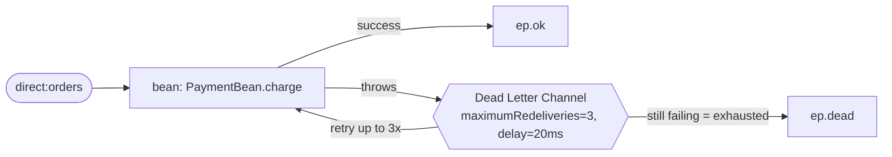

<!-- SPDX-License-Identifier: CC-BY-4.0 -->
# 19 · Dead Letter Channel & Redelivery: Do Not Lose the Failing Order

## Objective
When a step fails, **don't drop the message** — retry it a few times, and if it still won't go
through, move it to a dedicated **Dead Letter Channel** for later inspection or replay. Reach for this
pattern whenever "the downstream might be flaky or the payload might be bad" and silently losing the
message is unacceptable.

Two knobs do the work:

- **The redelivery policy** — how hard to retry: `maximumRedeliveries(3)`, `redeliveryDelay(20)` (ms),
  and (not used here, but worth knowing) `backOffMultiplier(2)` to grow the delay exponentially
  (20ms → 40ms → 80ms …). Turn `backOffMultiplier` on and you spread retries out instead of hammering a
  struggling downstream.
- **The dead letter endpoint** — where the give-up message goes: `deadLetterChannel("{{ep.dead}}")`.

**`errorHandler` vs `onException`.** This module scopes the policy to the whole route with
`errorHandler(deadLetterChannel(...))` — it catches **any** exception. When you want *different*
handling per exception type (e.g. retry `IOException` but send `ValidationException` straight to dead),
you'd add `onException(SomeException.class)...` clauses; the most specific `onException` wins, and the
route-level `errorHandler` is the fallback. Same redelivery machinery, finer targeting.

## Scenario
ShopFlow charges each order through a payment gateway (`PaymentBean`). Most cards clear on the first
try; some are **permanently declined** (the demo flags these with `failPayment=true`, and the bean
throws every time).

| Order | What happens |
|---|---|
| good card (`failPayment=false`) | charged once, flows on to the OK channel (`ep.ok`) |
| declined card (`failPayment=true`) | retried 3× (20ms apart), still fails → Dead Letter Channel (`ep.dead`) |

Because the Dead Letter Channel **handles** the exhausted exchange, the caller of `direct:orders` does
**not** see the exception (unlike Camel's *default* error handler, which rethrows). The message is safe
on `ep.dead` instead of lost.

The terminal targets are **property placeholders** (`{{ep.ok}}`, `{{ep.dead}}`). In production they'd be
`direct:`/`jms:` endpoints; in tests they resolve to `mock:` endpoints so we can prove where each order
ends up.

**Inspecting the dead letter.** When Camel moves an exhausted exchange to the DLC it stamps redelivery
headers on it — most usefully `CamelRedeliveryExhausted=true` (constant `Exchange.REDELIVERY_EXHAUSTED`)
and `CamelRedeliveryCounter` (how many retries happened). The test asserts the exhausted header, and the
`ep.dead` log endpoint uses `showAll=true` so you can see them in the console.

## Message flow

`direct:orders --bean:charge--> [ok] ep.ok | [throws]--retry x3--> exhausted --> ep.dead`

## Components used
| Dependency | Why |
|---|---|
| `camel-spring-boot-starter` | boots the CamelContext + auto-discovers routes; provides `direct:`, `log:`, `timer:`, `mock:`, the bean/Processor DSL, and the Dead Letter Channel error handler + redelivery policy (all in `camel-core`) |

No broker needed — the "dead letter" is an in-memory `log:`/`mock:` endpoint, so this pattern runs
entirely in-memory. In production you'd point `ep.dead` at a durable queue (`jms:`, `kafka:`, a table)
so exhausted messages survive a restart.

## How to run
```bash
# From the repo root. Red Hat build (default):
./mvnw -pl patterns/19-dead-letter-channel spring-boot:run
# Behind a firewall / no Red Hat access — plain Apache Camel:
./mvnw -P upstream -pl patterns/19-dead-letter-channel spring-boot:run
```
A demo feeder injects a good order and a declined order in alternation every 5s, so you'll see a clean
`Order A-1001 paid OK` for the good ones, and for the declined ones three retry attempts followed by the
exchange landing on the `log:dead` endpoint with its `CamelRedeliveryExhausted` header showing.

## Test it
```bash
./mvnw -pl patterns/19-dead-letter-channel test
```
Two tests prove the pattern: a good order reaches `mock:ok` with exactly **one** payment attempt and
**zero** dead letters; a declined order reaches `mock:dead` (carrying `CamelRedeliveryExhausted=true`)
with **zero** on `mock:ok` — after exactly **four** gateway calls (1 original + 3 redeliveries). Read the
test as the spec.
