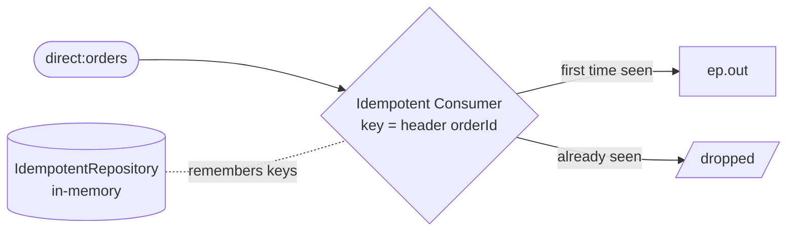

<!-- SPDX-License-Identifier: CC-BY-4.0 -->
# 20 · Idempotent Consumer: Process Each Order Exactly Once

## Objective
Process each message **exactly once** by dropping duplicates. Reach for this pattern whenever the same
logical message can arrive more than once — a broker redelivers after a timeout, an upstream system
replays a batch, or a customer taps "Pay" twice — and repeating the work would be harmful (double charge,
double shipment).

## Scenario
ShopFlow receives orders on `direct:orders`. Every order carries a stable **idempotency key** in its
`orderId` header. The Idempotent Consumer remembers the keys it has already seen:

| Delivery | `orderId` | Outcome |
|---|---|---|
| 1st order arrives | `A-1001` | new key → processed → `ep.out` |
| same order redelivered | `A-1001` | key already seen → **dropped** |
| a different order | `A-1002` | new key → processed → `ep.out` |

The exactly-once destination is a **property placeholder** (`{{ep.out}}`). In production it'd be a
`direct:`/`jms:` endpoint; in tests it resolves to a `mock:` endpoint so we can prove the deduplication.
Sample payloads live in `src/test/resources/data/` — note `order-A-1001.json` and
`order-A-1001-resubmit.json` share the same `orderId`, so only the first is processed.

## Message flow

`direct:orders --idempotentConsumer(header orderId)--> [new key] ep.out | [seen key] dropped`

## Components used
| Dependency | Why |
|---|---|
| `camel-spring-boot-starter` | boots the CamelContext + auto-discovers routes; provides `direct:`, `log:`, `mock:`, `timer:`, the Simple language, the **Idempotent Consumer** EIP and the in-memory `MemoryIdempotentRepository` (all in `camel-core`) |

No broker or database needed — this pattern runs entirely in-memory.

**In-memory vs persistent repository.** `MemoryIdempotentRepository.memoryIdempotentRepository()` keeps the
seen-keys set in a plain heap cache: ideal for a single JVM and for tests, but it forgets on restart and
is not shared across instances. In production you swap in a persistent/shared repository — JDBC
(`camel-sql`/`JdbcMessageIdRepository`), Infinispan, Redis, Hazelcast, or Caffeine — so deduplication
survives restarts and works across a cluster. The DSL is identical; only the repository argument changes.

**Where it fits.** The Idempotent Consumer **complements** at-least-once broker redelivery: the broker
guarantees you never *lose* a message by redelivering it, and this pattern guarantees a redelivered (or
double-submitted) message is not *acted on twice*. It's the consumer-side half of end-to-end
exactly-once handling.

## How to run
```bash
# From the repo root. Red Hat build (default):
./mvnw -pl patterns/20-idempotent-consumer spring-boot:run
# Behind a firewall / no Red Hat access — plain Apache Camel:
./mvnw -P upstream -pl patterns/20-idempotent-consumer spring-boot:run
```
A demo feeder emits each order **twice** (every 3s). You'll see the first copy logged as
`Processing order A-1000 ...` landing on `log:out`, while its immediate duplicate is silently dropped.

## Test it
```bash
./mvnw -pl patterns/20-idempotent-consumer test
```
The test sends `orderId=A-1001` **twice** and asserts `mock:out` fires **exactly once**, then sends a
distinct `orderId=A-1002` and asserts `mock:out` now has **2 total**. Read the test as the spec.
