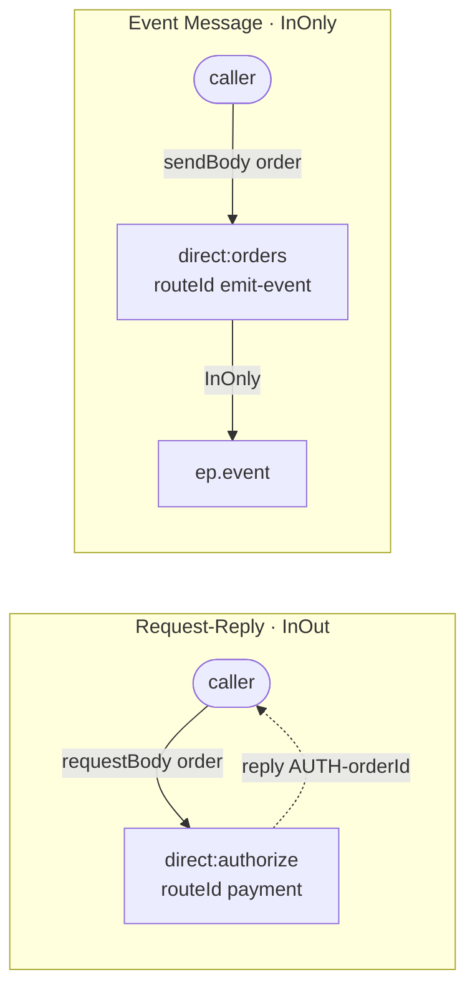

<!-- SPDX-License-Identifier: CC-BY-4.0 -->
# 21 · Request-Reply vs Event Message

## Objective
Two message exchange patterns, side by side:

- **Request-Reply** (`InOut`): the caller sends a message and **blocks until a correlated reply comes back**.
  Use it when you need the answer *now* to keep going — e.g. "authorize this payment."
- **Event Message** (`InOnly`): the caller **announces that something happened and moves on** — no reply is
  expected or awaited (fire-and-forget). Use it to notify 0..N interested parties without coupling to them.

Choosing the wrong one is a classic integration bug: waiting for a reply that never comes, or firing-and-forgetting
an operation whose result you actually needed.

## Scenario
ShopFlow does two things when an order lands:

| Interaction | Pattern | Channel | What the caller gets back |
|---|---|---|---|
| Authorize the payment | Request-Reply (`InOut`) | `direct:authorize` (route `payment`) | the reply body `AUTH-<orderId>` |
| Announce "order received" | Event Message (`InOnly`) | `direct:orders` (route `emit-event`) → `ep.event` | nothing — it's one-way |

Callers use the `ProducerTemplate`: `requestBody(...)` for the InOut auth call, `sendBody(...)` for the one-way
event. The event destination is a **property placeholder** (`{{ep.event}}`): in production it'd be a topic
(`jms:topic:orders`); in tests it resolves to a `mock:` endpoint so we can prove exactly one InOnly message flowed.

## Message flow

`Request-Reply: requestBody -> direct:authorize --reply--> AUTH-orderId  ||  Event: sendBody -> direct:orders --InOnly--> ep.event`

## Components used
| Dependency | Why |
|---|---|
| `camel-spring-boot-starter` | boots the CamelContext + auto-discovers routes; provides `direct:`, `log:`, `timer:`, `mock:`, the Simple language, and the `ProducerTemplate` bean used for `requestBody`/`sendBody` (all in `camel-core`) |

No broker needed — both exchange patterns run entirely in-memory. At scale, correlating a reply to its request
over a real broker (many concurrent callers on a shared reply queue) needs a **Correlation Identifier**; here Camel's
`direct:` reply handling does it for you in-process.

## How to run
```bash
# From the repo root. Red Hat build (default):
./mvnw -pl patterns/21-request-reply-and-event-message spring-boot:run
# Behind a firewall / no Red Hat access — plain Apache Camel:
./mvnw -P upstream -pl patterns/21-request-reply-and-event-message spring-boot:run
```
A demo feeder fires every 3s: it does a **Request-Reply** call to get `AUTH-A-100x` (blocking for the reply),
then emits a one-way **Event Message**, so you'll see both an `AUTH-...` reply and an event landing on `log:event`.

## Test it
```bash
./mvnw -pl patterns/21-request-reply-and-event-message test
```
Two tests prove the spec: `requestBody("direct:authorize", order)` returns `AUTH-A-1001` (the correlated InOut reply),
and sending one order to `direct:orders` lands **exactly one** message on `mock:event` whose recorded pattern is
`InOnly` (fire-and-forget, no reply channel). Read the test as the spec.
