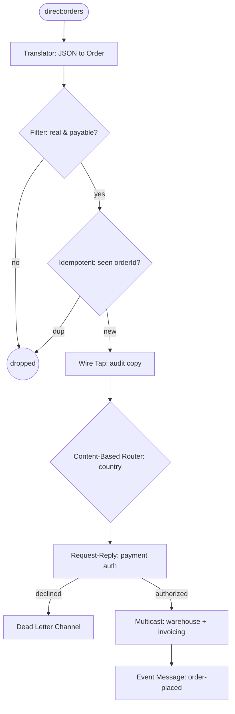

<!-- SPDX-License-Identifier: CC-BY-4.0 -->
# 99 · Capstone: the End-to-End ShopFlow Order Pipeline

## Objective
Assemble the patterns you've learned into ONE coherent order-processing pipeline, and see how they
compose — and why their **order** matters (idempotency before side effects, dead-letter around payment).

## Scenario
A JSON order enters ShopFlow and flows through eight EIPs: translate → filter test/zero orders →
de-duplicate by `orderId` → audit copy → route by country → authorize payment (waiting for the reply) →
fan out to warehouse + invoicing → publish an `order-placed` event. A declined payment is retried once
then parked in a dead-letter channel instead of being lost.

## Message flow

`JSON → translate → filter → idempotent → wiretap → route → pay(req/reply) → multicast → event  (declines → DLQ)`

## Components used
| Dependency | Why |
|---|---|
| `camel-spring-boot-starter` | CamelContext + routing DSL (direct:, mock:, choice, multicast, idempotent, wireTap, DLC) |
| `camel-jackson-starter` | the Message Translator (JSON ↔ `Order`) |

Eight patterns, all in-memory — no broker required.

## How to run
```bash
./mvnw -pl patterns/99-capstone-order-pipeline spring-boot:run
# or the plain Apache Camel build:
./mvnw -P upstream -pl patterns/99-capstone-order-pipeline spring-boot:run
```

## Test it
```bash
./mvnw -pl patterns/99-capstone-order-pipeline test
```
Four end-to-end tests prove: a valid domestic order reaches warehouse + invoicing and emits an event
(with an audit copy); test/zero-value orders are filtered; a duplicate `orderId` is processed once; and a
fraudulent order's declined payment lands in the dead-letter channel.
